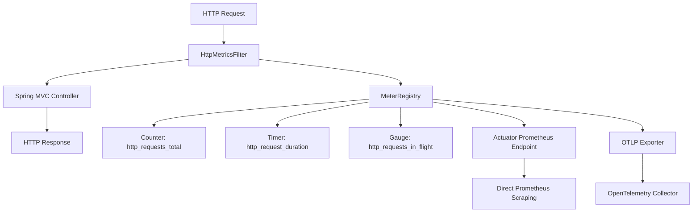

# Design Document

## Overview

This design implements standardized HTTP request metrics for the Globeco Execution Service using Spring Boot's Micrometer framework with OpenTelemetry (OTLP) export. The solution leverages a servlet filter approach to capture comprehensive HTTP metrics across all endpoints while maintaining high performance and reliability.

The implementation follows the battle-tested patterns from the java-microservice-http-metrics-implementation-guide.md, specifically using millisecond-based histogram buckets optimized for OpenTelemetry Collector export and avoiding common pitfalls like MeterFilter conflicts.

## Architecture

### High-Level Architecture



### Filter Chain Integration

The HttpMetricsFilter will be registered as a high-priority servlet filter (order=1) to ensure it captures all HTTP traffic before any other processing occurs. This positioning guarantees metrics are recorded even for requests that result in exceptions or errors.

### Metric Collection Strategy

The design uses three complementary metrics:
1. **Counter** - Tracks total request volume with dimensional labels
2. **Timer** - Records request duration with histogram distribution
3. **Gauge** - Monitors concurrent request load

## Components and Interfaces

### 1. HttpMetricsConfiguration

**Purpose**: Spring configuration class that registers metrics and filter components.

**Key Responsibilities**:
- Pre-register metrics with sample tags for immediate visibility
- Configure AtomicInteger for thread-safe in-flight request tracking
- Register the HttpMetricsFilter with proper ordering
- Initialize metric instances to avoid lazy creation delays

**Dependencies**: MeterRegistry (Spring Boot auto-configured)

### 2. HttpMetricsFilter

**Purpose**: Servlet filter that intercepts all HTTP requests to record metrics.

**Key Responsibilities**:
- Measure request timing with nanosecond precision
- Track concurrent requests using atomic operations
- Extract and normalize HTTP labels (method, path, status)
- Record metrics in finally blocks to ensure reliability
- Handle exceptions without disrupting request processing

**Thread Safety**: Uses ThreadLocal for request-specific data and AtomicInteger for shared counters.

**Performance Considerations**:
- Minimal overhead through efficient label extraction
- Path normalization to prevent cardinality explosion
- Millisecond-based duration recording for OTLP compatibility

### 3. Metric Definitions

#### http_requests_total (Counter)
- **Labels**: method, path, status
- **Increment Logic**: Once per completed request
- **Label Extraction**:
  - method: Uppercase HTTP method from HttpServletRequest
  - path: Route pattern from Spring MVC or normalized URI
  - status: String representation of HTTP status code

#### http_request_duration (Timer)
- **Labels**: method, path, status (same as counter)
- **Histogram Buckets**: [5, 10, 25, 50, 100, 250, 500, 1000, 2500, 5000, 10000] milliseconds
- **Recording Unit**: Milliseconds (for OTLP compatibility)
- **Timing Scope**: Request entry to response completion

#### http_requests_in_flight (Gauge)
- **Labels**: None
- **Update Logic**: Increment on request start, decrement on completion
- **Thread Safety**: AtomicInteger operations

## Data Models

### RequestMetrics (Internal Class)

```java
private static class RequestMetrics {
    private final long startTimeNanos;
    private final boolean inFlight;
    
    // Constructor and getters
}
```

**Purpose**: ThreadLocal storage for request-specific timing data.

### Label Extraction Models

The filter will extract labels using these patterns:

- **Method Normalization**: `request.getMethod().toUpperCase()`
- **Path Extraction**: Spring MVC handler mapping attributes or normalized URI
- **Status Normalization**: `String.valueOf(response.getStatus())`

### Path Normalization Rules

To prevent metric cardinality explosion:
- Replace numeric IDs: `/api/executions/123` → `/api/executions/{id}`
- Replace UUIDs: `/api/executions/550e8400-...` → `/api/executions/{uuid}`
- Preserve route patterns from Spring MVC when available

## Error Handling

### Metric Recording Failures

**Strategy**: Defensive programming with comprehensive exception handling.

**Implementation**:
- Wrap all metric recording in try-catch blocks
- Log metric errors at ERROR level without disrupting request flow
- Ensure in-flight counter is always decremented in finally blocks
- Continue request processing even if metrics fail

### Request Processing Exceptions

**Strategy**: Record metrics before exception propagation.

**Implementation**:
- Use try-finally pattern in filter to guarantee metric recording
- Capture timing and labels before exception handling
- Ensure thread-local cleanup occurs regardless of exceptions

### Thread Safety

**Strategy**: Minimize shared state and use atomic operations.

**Implementation**:
- ThreadLocal for request-specific data with mandatory cleanup
- AtomicInteger for in-flight request counting
- Immutable label values to prevent concurrent modification

## Testing Strategy

### Unit Testing

**HttpMetricsFilterTest**:
- Mock HttpServletRequest/Response and FilterChain
- Verify metric recording for successful requests
- Test exception handling scenarios
- Validate in-flight counter accuracy
- Confirm thread-local cleanup

**HttpMetricsConfigurationTest**:
- Verify bean registration and configuration
- Test metric pre-registration with sample tags
- Validate filter ordering and URL patterns

### Integration Testing

**MetricsEndpointTest**:
- Verify metrics appear at `/actuator/prometheus`
- Test metric values after actual HTTP requests
- Validate Prometheus format output
- Confirm OTLP export functionality

**Performance Testing**:
- Measure filter overhead under load
- Verify thread safety with concurrent requests
- Test metric cardinality limits with path normalization

### Validation Testing

**Metric Accuracy**:
- Compare recorded durations with actual request times
- Verify counter increments match request counts
- Validate in-flight gauge accuracy during concurrent load

## Configuration Integration

### Application Properties Updates

The existing application.properties already contains the necessary OTLP configuration:

```properties
# Existing OTLP configuration will be used
management.otlp.metrics.export.url=http://otel-collector-collector.monitoring.svc.cluster.local:4318/v1/metrics
management.endpoints.web.exposure.include=health,info,metrics,prometheus
```

### Dependency Requirements

The existing build.gradle already includes required dependencies:
- `spring-boot-starter-actuator` (Micrometer integration)
- `micrometer-registry-otlp` (OTLP export)
- `micrometer-tracing-bridge-otel` (OpenTelemetry integration)

No additional dependencies are required.

### Spring Boot Auto-Configuration

The implementation will leverage Spring Boot's auto-configured:
- MeterRegistry (with OTLP export enabled)
- Actuator endpoints (Prometheus endpoint)
- Filter registration mechanism

## Performance Considerations

### Overhead Minimization

**Timing Precision**: Use System.nanoTime() for accuracy but record in milliseconds for compatibility.

**Label Efficiency**: Cache normalized path patterns and reuse string constants.

**Memory Management**: Ensure ThreadLocal cleanup to prevent memory leaks.

### Cardinality Control

**Path Normalization**: Aggressive ID replacement to limit unique path values.

**Label Validation**: Sanitize label values to prevent unbounded cardinality.

**Metric Limits**: Monitor metric series count and implement safeguards if needed.

### Concurrency Optimization

**Lock-Free Operations**: Use atomic operations for shared counters.

**Thread Isolation**: Minimize shared state through ThreadLocal usage.

**Filter Ordering**: High priority (order=1) to minimize processing overhead.

## Deployment Considerations

### Kubernetes Integration

The service already runs in Kubernetes with OpenTelemetry Collector configured. The metrics will automatically flow through the existing observability pipeline.

### Monitoring Setup

**Immediate Visibility**: Pre-registered metrics ensure immediate appearance in monitoring systems.

**Dashboard Compatibility**: Metrics follow standard naming conventions for existing Grafana dashboards.

**Alerting Integration**: Standard metric names enable reuse of existing alerting rules.

### Rollback Strategy

**Feature Toggle**: Configuration-based disable option if needed.

**Graceful Degradation**: Service continues normal operation if metrics fail.

**Monitoring**: Track metric export success rates to detect issues early.

This design provides a robust, performant, and maintainable solution for HTTP metrics collection that integrates seamlessly with the existing Globeco Execution Service architecture and observability infrastructure.