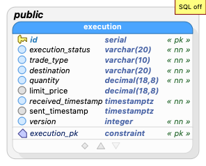

# globeco-execution-service

The Execution Service in the GlobeCo suite for benchmarking Kubernetes autoscaling.

## Overview

The Execution Service acts as a bridge between the trading service and the FIX engine. It receives trades synchronously from the trading service and sends them to the FIX engine as Kafka events. The service is designed for high scalability and observability, and is deployed on Kubernetes.

## Features
- RESTful API for managing executions
- PostgreSQL for persistent storage
- Kafka integration for event streaming
- Trade service integration for execution updates
- Caching with Caffeine (5 minute TTL)
- Database migrations with Flyway
- Health checks for Kubernetes (liveness, readiness, startup)
- Testcontainers-based integration tests
- OpenAPI documentation

## Technology Stack
- Java 21
- Spring Boot 3.4.5
- PostgreSQL 17
- Kafka
- Caffeine (caching)
- Flyway (migrations)
- Gradle (build tool)
- Testcontainers (testing)

## Configuration

Configuration is managed via `src/main/resources/application.properties`:

```properties
spring.datasource.url=jdbc:postgresql://globeco-execution-service-postgresql:5432/postgres
spring.datasource.username=postgres
spring.datasource.password=
spring.kafka.bootstrap-servers=globeco-execution-service-kafka-kafka-1:9092
kafka.topic.orders=orders

# Trade service integration
trade.service.host=globeco-trade-service
trade.service.port=8082
trade.service.base-url=http://${trade.service.host}:${trade.service.port}
trade.service.timeout=5000
trade.service.retry.enabled=true
trade.service.retry.max-attempts=2
```


## Kafka
- Bootstrap server: `globeco-execution-service-kafka-kafka-1:9092`
- Topic: `orders`

## Database
- Schema managed by Flyway (`src/main/resources/db/migration/V1__init.sql`)
- Main table: `execution`

### Entity Relationship Diagram




### Data Dictionary

### _public_.**execution** `Table`
| Name | Data type  | PK | FK | UQ  | Not null | Default value | Description |
| --- | --- | :---: | :---: | :---: | :---: | --- | --- |
| id | serial | &#10003; |  |  | &#10003; |  |  |
| execution_status | varchar(20) |  |  |  | &#10003; |  |  |
| trade_type | varchar(10) |  |  |  | &#10003; |  |  |
| destination | varchar(20) |  |  |  | &#10003; |  |  |
| security_id | char(24) |  |  |  | &#10003; |  |  |
| quantity | decimal(18,8) |  |  |  | &#10003; |  |  |
| limit_price | decimal(18,8) |  |  |  |  |  |  |
| received_timestamp | timestamptz |  |  |  | &#10003; |  |  |
| sent_timestamp | timestamptz |  |  |  |  |  |  |
| trade_service_execution_id | integer |  |  |  |  |  |  |
| quantity_filled | decimal(18,8) |  |  |  |  | 0 | Amount of the order that has been filled |
| average_price | decimal(18,8) |  |  |  |  |  | Average price of filled quantities |
| version | integer |  |  |  | &#10003; | 1 | Optimistic locking version |

#### Constraints
| Name | Type | Column(s) | References | On Update | On Delete | Expression | Description |
|  --- | --- | --- | --- | --- | --- | --- | --- |
| execution_pk | PRIMARY KEY | id |  |  |  |  |  |

---


## REST API

| Method | Path                  | Request Body         | Response Body        | Description                       |
|--------|-----------------------|---------------------|----------------------|-----------------------------------|
| GET    | /api/v1/executions      |                     | [ExecutionDTO]         | List all executions                 |
| GET    | /api/v1/execution/{id} |                     | ExecutionDTO           | Get an execution by ID               |
| POST   | /api/v1/executions      | ExecutionPostDTO   | ExecutionDTO           | Create a new execution              |
| PUT    | /api/v1/execution/{id} | ExecutionPutDTO    | ExecutionDTO           | Update an execution (fill quantities) |

### Data Transfer Objects
- `ExecutionPostDTO`: Used for creating executions
- `ExecutionPutDTO`: Used for updating execution fill quantities and prices
- `ExecutionDTO`: Used for returning execution data

### PUT Endpoint Details

The PUT endpoint `/api/v1/execution/{id}` is used to update execution fill information:

#### Request Body (`ExecutionPutDTO`)
```json
{
  "quantityFilled": 4.50,
  "averagePrice": 105.25,
  "version": 1
}
```

#### Response Body (`ExecutionDTO`)
```json
{
  "id": 1,
  "executionStatus": "PART",
  "tradeType": "BUY",
  "destination": "NYSE",
  "securityId": "SEC123456789012345678901",
  "quantity": 10.00000000,
  "limitPrice": 100.00000000,
  "receivedTimestamp": "2025-01-27T15:30:00Z",
  "sentTimestamp": "2025-01-27T15:30:01Z",
  "tradeServiceExecutionId": 1,
  "quantityFilled": 4.50000000,
  "averagePrice": 105.25000000,
  "version": 2
}
```

#### Business Logic
- `quantityFilled` in the request is **added** to the existing `quantity_filled` in the database
- `averagePrice` in the request **replaces** the existing `average_price` in the database
- After the update:
  - If `quantity_filled` < `quantity`: `execution_status` is set to "PART"
  - If `quantity_filled` >= `quantity`: `execution_status` is set to "FULL"
- Uses optimistic concurrency control via the `version` field

## Trade Service Integration

The execution service automatically integrates with the trade service to keep execution data synchronized.

### Integration Workflow

When an execution is updated via the PUT `/api/v1/execution/{id}` endpoint:

1. **Database Update**: The execution service updates its local database first
2. **Trade Service Sync**: After successful database update, the service automatically:
   - Retrieves the current version from the trade service via `GET /api/v1/executions/{id}`
   - Updates the trade service via `PUT /api/v1/executions/{id}/fill`

### Configuration Properties

| Property | Default | Description |
|----------|---------|-------------|
| `trade.service.host` | `globeco-trade-service` | Trade service hostname |
| `trade.service.port` | `8082` | Trade service port |
| `trade.service.base-url` | `http://${trade.service.host}:${trade.service.port}` | Full base URL |
| `trade.service.timeout` | `5000` | HTTP timeout in milliseconds |
| `trade.service.retry.enabled` | `true` | Enable retry on conflicts |
| `trade.service.retry.max-attempts` | `2` | Maximum retry attempts |

### Error Handling

The trade service integration is designed to be **non-blocking** and **resilient**:

- **Network Errors**: Logged but don't affect execution service functionality
- **404 Not Found**: Logged as warning, execution continues normally
- **409 Conflict**: Automatic retry with fresh version (if retry enabled)
- **Timeouts**: Configurable timeouts with graceful handling
- **Service Unavailable**: Execution service continues to function normally

### Field Mapping

| Execution Service Field | Trade Service Field | Description |
|------------------------|-------------------|-------------|
| `trade_service_execution_id` | `{id}` (URL path) | Used to identify the execution in trade service |
| `execution_status` | `executionStatus` | Current status ("PART", "FULL", etc.) |
| `quantity_filled` | `quantityFilled` | Total quantity filled |
| N/A | `version` | Retrieved from trade service for optimistic locking |

## Health Checks
- Liveness: `/actuator/health/liveness`
- Readiness: `/actuator/health/readiness`
- Startup: `/actuator/health/startup`

## Testing
- Unit and integration tests use Testcontainers for PostgreSQL and Kafka
- Trade service integration tests use mocked HTTP responses
- Tests are located in `src/test/java/org/kasbench/globeco_execution_service/`

## Running Locally

1. Start PostgreSQL and Kafka (see configuration above)
2. Run the application:
   ```sh
   ./gradlew bootRun
   ```
3. Access the API at `http://localhost:8084/api/v1/execution`

## Database Migration
- Flyway will automatically apply migrations on startup

## Deployment
- Designed for Kubernetes deployment
- Health checks are enabled for liveness, readiness, and startup


## OpenAPI & Documentation
- OpenAPI schema: [http://localhost:8084/v3/api-docs](http://localhost:8084/v3/api-docs)
- Swagger UI: [http://localhost:8084/swagger-ui.html](http://localhost:8084/swagger-ui.html)

## Author
Noah Krieger (<noah@kasbench.org>)


---
For more details, see the requirements in `documentation/requirements.md`.
